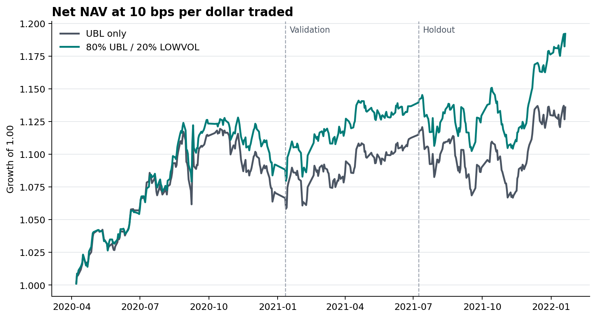
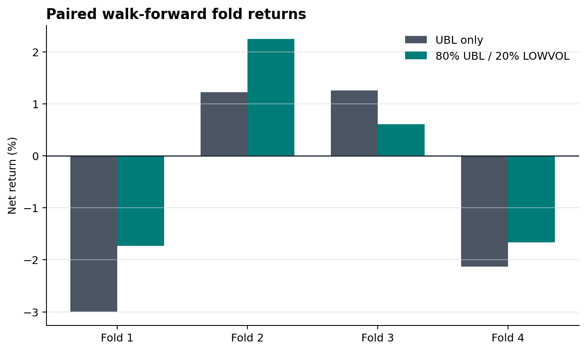
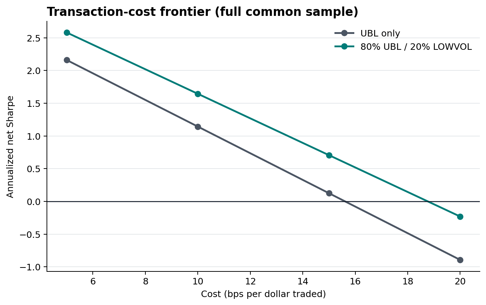
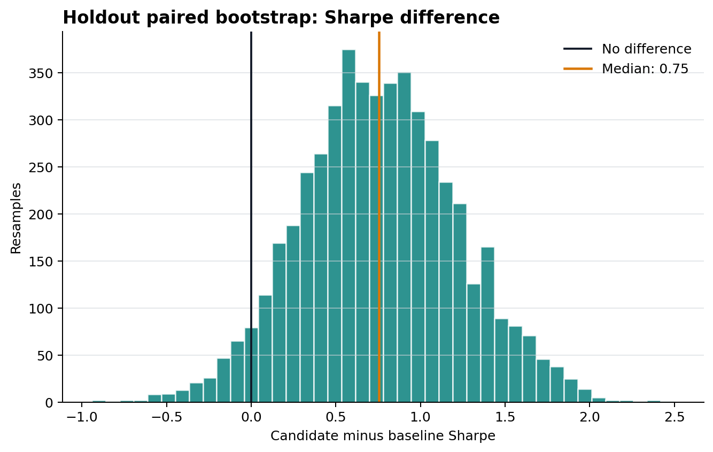

# Cost-Aware Cross-Sectional Alpha Research

This repository contains two complementary components:

1. A documented China A-share portfolio case study supported by
   checksum-protected aggregate evidence.
2. A strategy-agnostic Python package for point-in-time validation,
   portfolio accounting, transaction costs, paired block-bootstrap
   comparisons, and report generation.

The public package begins with precomputed, directionally oriented factor
scores. Report-derived factor implementations, licensed market data, and
the internal security-level research engine are not redistributed.

> Results are simulated and unaudited. They are not investment advice or live
> trading performance.



## Small Sample Package

The code under `src/alpha_research/` is intentionally small. Its purpose
is to make the research mechanics inspectable without publishing the strategies.

| Module             | Public responsibility                                                                 |
| ------------------ | ------------------------------------------------------------------------------------- |
| `runner.py`        | Validate timestamps, form score tails, calculate IC/RankIC, and build a weight ledger |
| `portfolio.py`     | Dollar-neutral normalization, sleeve combination, turnover, costs, and PnL            |
| `metrics.py`       | Sharpe, drawdown, summaries, and paired moving-block bootstrap                        |
| `visualization.py` | NAV, drawdown, turnover, RankIC, comparison plots, and Markdown reports               |

The runner always interprets a higher `alpha_score` as a higher expected
return. It requires:

```text
latest_factor_input_timestamp < entry_timestamp < exit_timestamp
```

It then records:

- previous, target, and executed security weights;
- weight changes and full/one-way turnover;
- gross PnL, security-level cost, and net PnL contributions;
- Pearson IC and Spearman RankIC;
- exposure, Sharpe, drawdown, and break-even cost.

Factor construction, universe selection, private data loading, strategy
parameters, borrow modeling, and live execution are outside this sample package.

## Installation And Tests

Python 3.10 or newer is recommended.

```bash
cd quant-factor-report-reproducer
python -m venv .venv
source .venv/bin/activate
pip install -e ".[dev]"
python -m pytest -q tests/test_sample_package.py
```

Run the anonymous synthetic example:

```bash
python examples/run_sample_package.py
```

It writes a synthetic input panel, daily results, a security-level weight
ledger, summary JSON, four plots, and `report.md` under
`outputs/sample_package/`. The generated performance is a mechanics
check, not an empirical claim.

Regenerate the six committed portfolio figures from the public aggregate
CSVs:

```bash
python examples/render_public_results.py
```

Release maintainers can rebuild both the aggregate CSVs and figures from a
verified private snapshot. The command refuses dirty source or public
worktrees:

```bash
PRIVATE_SNAPSHOT=/path/to/immutable/ubl_lowvol_snapshot
python tools/build_public_evidence.py --source "$PRIVATE_SNAPSHOT"
```

## Input Schema

The generic runner expects one row per factor date and asset:

| Column                          | Meaning                              |
| ------------------------------- | ------------------------------------ |
| `factor_date`                   | Date associated with the score       |
| `latest_factor_input_timestamp` | Latest information used by the score |
| `entry_timestamp`               | Simulated execution timestamp        |
| `exit_timestamp`                | Return-measurement endpoint          |
| `asset`                         | Anonymous or public asset identifier |
| `alpha_score`                   | Oriented score; higher means better  |
| `forward_return`                | Realized return strictly after entry |

## API Example

```python
import pandas as pd

from alpha_research import (
    BacktestConfig,
    Visualizer,
    run_cross_sectional_backtest,
)

panel = pd.read_csv(
    "oriented_scores_and_returns.csv",
    parse_dates=[
        "factor_date",
        "latest_factor_input_timestamp",
        "entry_timestamp",
        "exit_timestamp",
    ],
)

result = run_cross_sectional_backtest(
    panel,
    BacktestConfig(
        long_fraction=0.20,
        short_fraction=0.20,
        cost_bps=10.0,
        band_bps=5.0,
    ),
)

Visualizer(result).save_report("outputs/example_report")
```

## Research-Holdout Comparison

On a 133-observation chronological research holdout, the frozen 80% UBL / 20%
LOWVOL_60 portfolio had net Sharpe 1.36 after a 10 bps per dollar traded cost
model, versus 0.60 for UBL alone. Net max drawdown declined from 4.82% to 4.05%,
average full turnover declined from 0.532 to 0.462, and break-even cost increased
from 13.12 to 17.93 bps.

Across four frozen paired block-bootstrap schemes, the blend had higher Sharpe
than UBL in 95.2% of resamples from the observed holdout.

| Metric                                 | UBL only  | UBL + LOWVOL |
| -------------------------------------- | --------- | ------------ |
| Research-holdout net Sharpe            | 0.60      | 1.36         |
| Research-holdout net return            | 2.10%     | 4.87%        |
| Research-holdout net max drawdown      | 4.82%     | 4.05%        |
| Average full turnover                  | 0.532     | 0.462        |
| Break-even cost                        | 13.12 bps | 17.93 bps    |
| Paired bootstrap P(Sharpe improvement) | -         | 95.2%        |

All returns are model results. Sharpe is annualized with a zero cash hurdle.
Turnover is full turnover, `sum(abs(w_t - w_t-1))`, for a book
normalized to long gross +1 and short gross -1.

## Robustness Results

The holdout comparison favors the blend, while results remain uneven across
time.

| Robustness check                          | Result |
| ----------------------------------------- | ------ |
| Validation net Sharpe                     | 1.69   |
| Full-common-sample net Sharpe             | 1.64   |
| Full-common-sample net Sharpe at 15 bps   | 0.71   |
| Paired walk-forward Sharpe                | -0.07  |
| Positive walk-forward folds               | 2 / 4  |
| One-additional-day execution-delay Sharpe | 0.46   |

The paired walk-forward aggregate remains slightly negative and only two of four
folds are positive. The additional execution day materially weakens the result.
These observations limit the current interpretation and motivate a new-data
test.



## Frozen Portfolio Specification

**UBL family sleeve**

| Component   | Internal risk budget |
| ----------- | -------------------- |
| PaperUBL 3D | 60%                  |
| UBL_M20 3D  | 20%                  |
| UBL_M5 5D   | 20%                  |

The UBL family first applies its frozen 7.5 bps security-weight-change band and
is then treated as one top-level sleeve.

**Top-level blend**

| Sleeve     | Risk budget |
| ---------- | ----------- |
| UBL family | 80%         |
| LOWVOL_60  | 20%         |

Each sleeve is divided by training-only realized portfolio volatility. Security
weights are combined, normalized to long +1 / short -1, passed through a common
7.5 bps no-trade band, and charged costs on final aggregate trades. Standalone
net-return series are not averaged.

## Research Contract

- **Signal timing:** complete data at date `t` is used only for a
  portfolio entered at the next tradable VWAP.
- **Direction:** every factor emits an oriented `alpha_score`.
- **Portfolio:** market-neutral long/short, net exposure 0, gross exposure 2.
- **Costs:** base 10 bps per dollar traded, applied to full turnover; 5/10/15/20
  bps sensitivity is reported.
- **Splits:** train 2020, validation first half of 2021, research holdout second
  half of 2021 through January 2022.
- **Selection:** budgets, LOWVOL_60 window, UBL family composition, and no-trade
  rule were fixed before the combined-portfolio comparison.
- **Statistics:** paired same-date resampling, fixed-rule walk-forward folds,
  cost stress, PnL concentration, delay sensitivity, and exposure checks.

See [methodology.md](docs/methodology.md) for definitions and the
[point-in-time timing contract](docs/methodology.md#point-in-time-timing).

## Selected Figures

### Transaction-Cost Frontier



The blend remains positive at 15 bps on the full common sample, while both
portfolios are negative at 20 bps.

### Paired Holdout Bootstrap



The plot shows the 5-day moving-block specification with 5,000 resamples. The
reported 95.2% is the mean frequency across four frozen block schemes. It is an
observed-sample resampling frequency, not a probability of future profitability.

The full figure set and data dictionary are in the
[portfolio output bundle](examples/sample_outputs/ubl_lowvol_study/README.md).

## Evidence Provenance

The current bundle was regenerated from private research commit
`96283e987df4d7000f3a6a14eb504201d765bcea`. The private source tree and
the public curation tree were both clean before generation. The
[evidence manifest](examples/sample_outputs/ubl_lowvol_study/data/evidence_manifest.json)
records the source tree, configuration, dependency-lock, builder, renderer, and
artifact hashes.

The public figures are reproducible from the committed aggregate CSVs. The
security-level strategy is intentionally not independently reproducible here
because formulas, holdings, licensed data, and the private engine are excluded.

## Repository Map

```text
.
|-- src/alpha_research/
|   |-- __init__.py
|   |-- metrics.py
|   |-- portfolio.py
|   |-- runner.py
|   `-- visualization.py
|-- examples/
|   |-- run_sample_package.py
|   |-- render_public_results.py
|   `-- sample_outputs/ubl_lowvol_study/
|       |-- data/
|       `-- plots/
|-- tools/
|   `-- build_public_evidence.py
|-- tests/test_sample_package.py
|-- docs/
|   |-- methodology.md
|   |-- candidate_outcomes.md
|   |-- public_release_scope.md
|   |-- report_references.md
|   `-- case_studies/
|       |-- UBL.md
|       |-- PaperUBL.md
|       `-- ubl_lowvol_portfolio.md
|-- .agents/skills/factor-research-report-reproducer/
|-- pyproject.toml
`-- LICENSE
```

## Reviewing The Research

A suggested review order is:

1. Read the [methodology contract](docs/methodology.md).
2. Run the synthetic sample and inspect its weight ledger.
3. Review the [UBL family study](docs/case_studies/UBL.md) and
   [PaperUBL reconstruction](docs/case_studies/PaperUBL.md).
4. Compare UBL and UBL + LOWVOL in the
   [combined-portfolio study](docs/case_studies/ubl_lowvol_portfolio.md).
5. Inspect the committed CSV files and
   [evidence manifest](examples/sample_outputs/ubl_lowvol_study/data/evidence_manifest.json).
6. Review [candidate outcomes](docs/candidate_outcomes.md) and the remaining
   limitations.

The sample package demonstrates mechanics. It cannot reproduce the private
security-level backtest from the aggregate evidence.

## Research Sequence

- Reconstruct the paper-style UBL reference.
- Audit direction and point-in-time timing.
- Compare holding horizons and rebalance offsets.
- Test family redundancy and incremental return information.
- Attribute turnover and freeze a no-trade rule.
- Evaluate economic exposures, capacity, and weak regimes.
- Evaluate and close the medium-term momentum candidates.
- Qualify LOWVOL_60 as a defensive sleeve.
- Compare the frozen UBL portfolio with the UBL + LOWVOL portfolio.

## Limitations And Open Questions

- The research holdout has been viewed and is now confirmation-only.
- The 133-observation holdout is short and regime-specific.
- Paired walk-forward performance is negative with only 2/4 positive folds.
- LOWVOL_60 varies substantially by period: validation Sharpe is near zero while
  holdout Sharpe is higher.
- An additional day of execution delay cuts the selected full-sample Sharpe to
  0.46.
- Borrow availability, financing, market impact, and short-sale constraints are
  not modeled.
- Adjusted-price provenance and pre-2020 LOWVOL_60 warm-up data were not
  independently verified.
- The public sample package is not the private strategy engine and does not
  reproduce the published aggregate returns by itself.

The next planned research test is unchanged-rule replication on genuinely new,
adjustment-verified data with borrow and execution evidence.

## Candidate Outcomes

Two conventional medium-term momentum definitions were frozen with a positive
direction and were not selected. Both had negative validation RankIC and
negative gross and net returns. Their predefined sign was retained throughout
evaluation. Details are in
[candidate_outcomes.md](docs/candidate_outcomes.md).

## Optional Report-Reproduction Skill

The repository retains
[the factor research report reproducer](.agents/skills/factor-research-report-reproducer/SKILL.md)
as an optional methodology and documentation tool. It does not expose the
private research engine.

## License

Code, documentation, and released artifacts are covered by the
[MIT License](LICENSE). Published metrics are research artifacts and carry no
warranty of investment performance.
