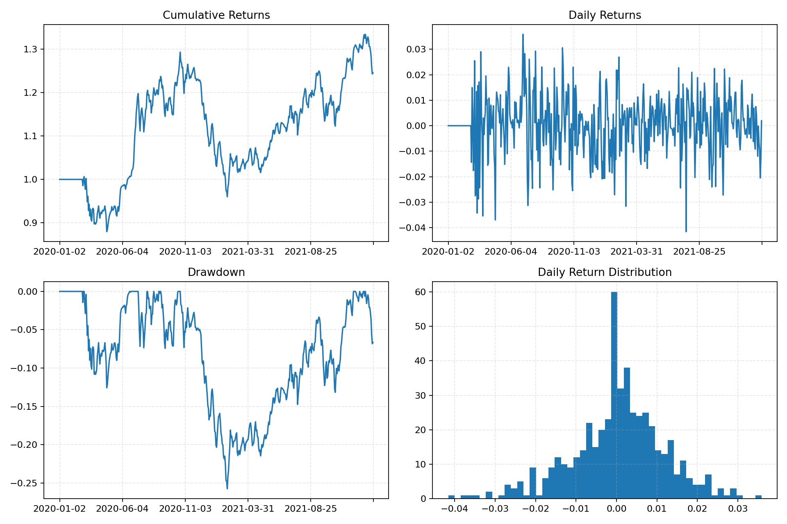
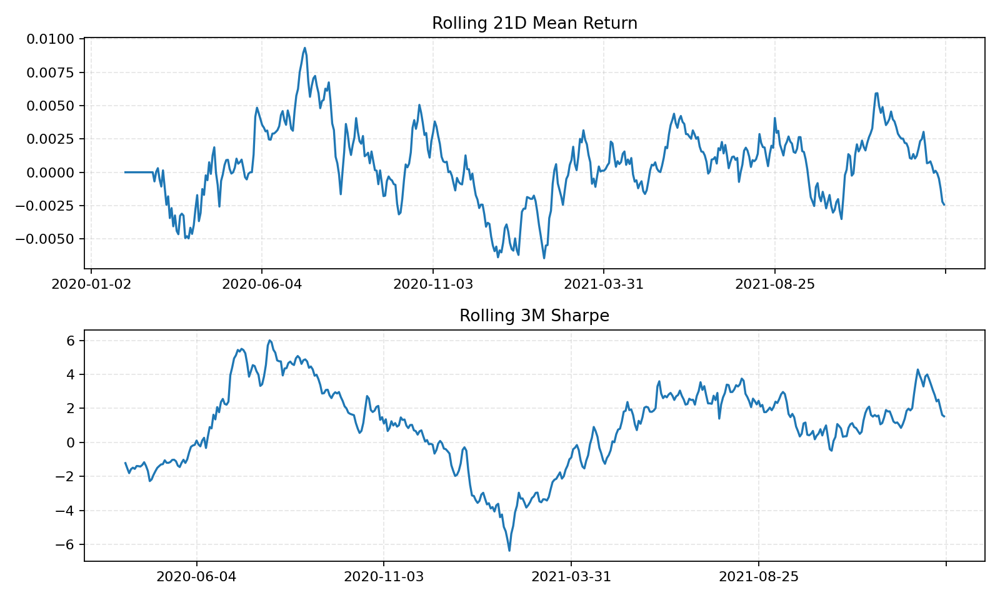
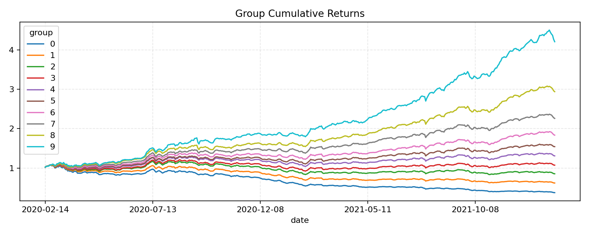
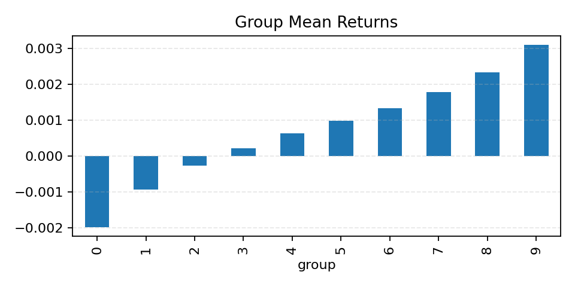
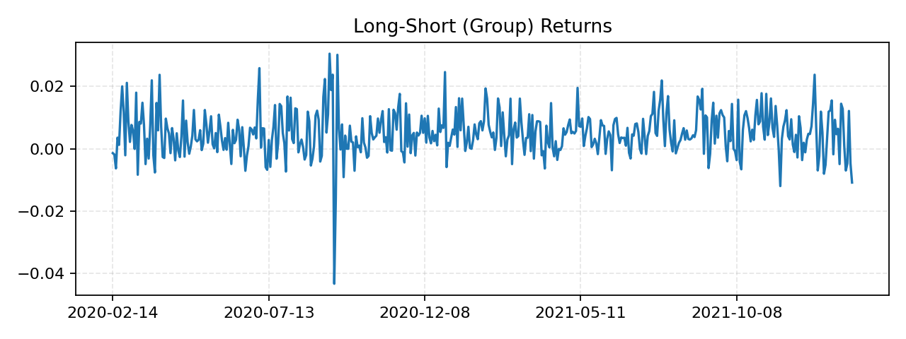
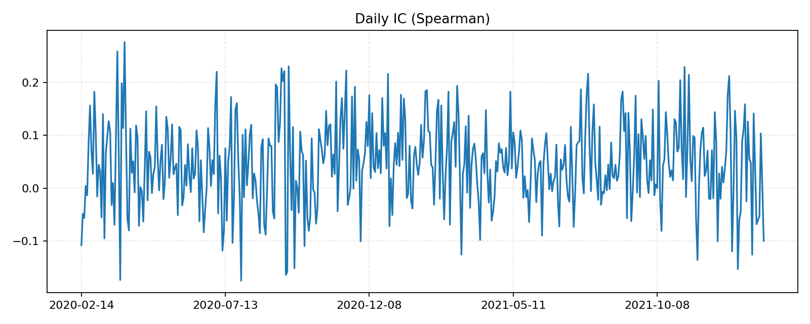
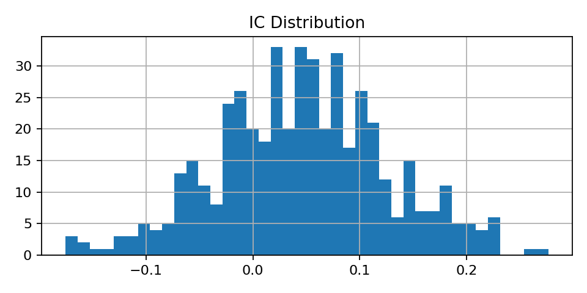

# Backtest Report: 001__paper_ubl__enable_cost-True__n_groups-10__rebalance_freq-month_start__top_n-50

## Setup

- Strategy: PaperUBL
- Period: 2020-01-02 to 2022-01-21
- Engine params: `{"calculate_ic": true, "enable_cost": true, "n_groups": 10, "rebalance_freq": "month_start", "top_n": 50}`
- Strategy params: `{}`

## Performance

| Metric | Value |
|---|---:|
| Total return | 24.52% |
| Annual return | 12.73% |
| Annual volatility | 18.28% |
| Sharpe | 0.5321 |
| Max drawdown | 25.75% |
| Calmar | 0.4943 |
| Win rate | 52.60% |
| Best day | 3.59% |
| Worst day | -4.16% |

## Factor Quality

| Metric | Value |
|---|---:|
| IC mean | 0.0467 |
| IC std | 0.0798 |
| IR | 0.5857 |
| IC win rate | 71.58% |

## Trading

| Metric | Value |
|---|---:|
| Total cost | 89756.90 |
| Trade count | 2236 |
| Avg turnover | 99.39% |

## Group Long-Short

- Mean daily long-short return: 0.51%
- Daily long-short volatility: 0.71%
- Observations: 475

## Notebook Visualizer Results

### Key Metrics

| Metric | Value |
|---|---:|
| total_return | 0.245192 |
| annual_return | 0.127255 |
| annual_volatility | 0.182776 |
| max_drawdown | 0.257465 |
| sharpe_ratio | 0.532101 |
| calmar_ratio | 0.494263 |
| win_rate | 0.526 |
| ic_mean | 0.0467276 |
| ic_std | 0.0797844 |
| ir | 0.585673 |
| ic_win_rate | 0.715789 |

### Group Mean Returns

| Group | Mean Return |
|---:|---:|
| 0 | -0.00198063 |
| 1 | -0.00093685 |
| 2 | -0.000264503 |
| 3 | 0.000211934 |
| 4 | 0.000629445 |
| 5 | 0.000973823 |
| 6 | 0.00133804 |
| 7 | 0.00177799 |
| 8 | 0.00232958 |
| 9 | 0.00309959 |

### Rolling Metrics Tail

| index | rolling_21d_mean_return | rolling_63d_volatility | rolling_3m_sharpe |
|---|---|---|---|
| 2022-01-17 | -8.09444e-05 | 0.0089445 | 2.41627 |
| 2022-01-18 | -0.000473801 | 0.00887859 | 2.51812 |
| 2022-01-19 | -0.00122625 | 0.00923943 | 2.05336 |
| 2022-01-20 | -0.00221103 | 0.00939934 | 1.61509 |
| 2022-01-21 | -0.00242509 | 0.00938578 | 1.53447 |

### Plots

### Saved Result Files

- `key_metrics.csv`
- `drawdown_series.csv`
- `rolling_metrics.csv`
- `group_returns_pivot.csv`
- `group_cumulative_returns.csv`
- `group_mean_returns.csv`
