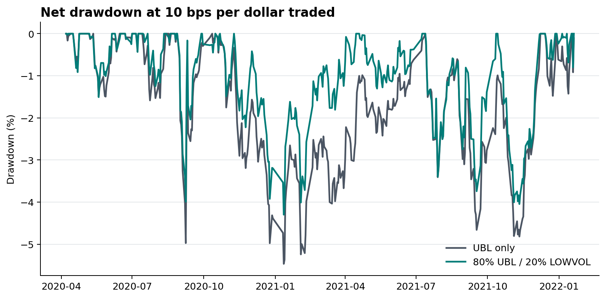
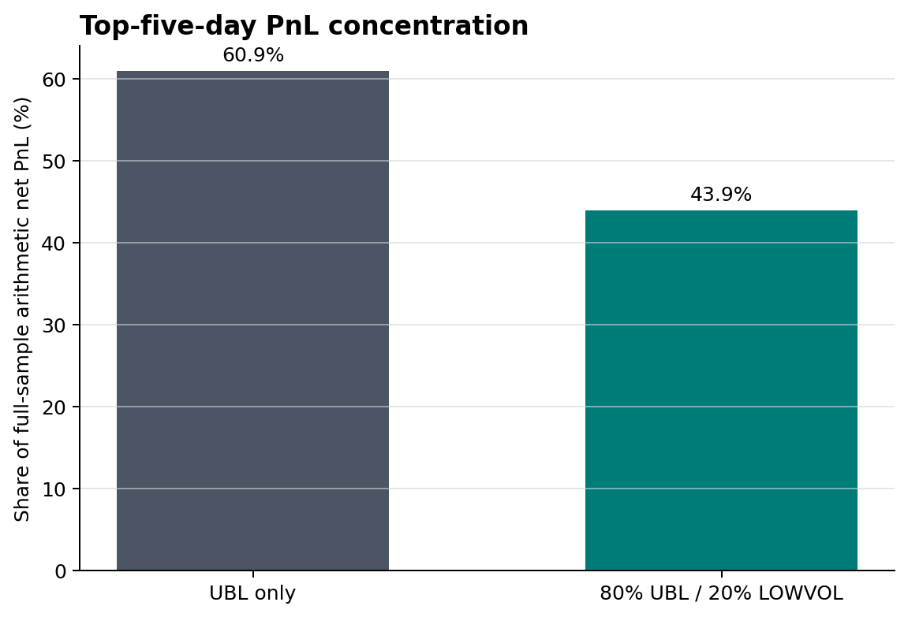

# UBL And LOWVOL Portfolio Results

This folder presents aggregate portfolio results for the UBL and LOWVOL
comparison. It does not distribute security-level holdings, raw prices,
report-derived factor implementations, or licensed market data.

## Observed Chronological Holdout

| Metric | UBL only | 80% UBL / 20% LOWVOL |
|---|---:|---:|
| Observations | 133 | 133 |
| Net return | 2.10% | 4.87% |
| Annualized net Sharpe, 0% cash hurdle | 0.60 | 1.36 |
| Max drawdown | 4.82% | 4.05% |
| Average full turnover | 0.532 | 0.462 |
| Break-even transaction cost | 13.12 bps | 17.93 bps |
| Fraction of paired bootstrap resamples with $\Delta \mathrm{Sharpe} > 0$ | - | 95.2% |

The comparison uses a 10 bps per dollar traded cost model on full turnover and
a gross-2 dollar-neutral book.

The chronological holdout contains 133 observations and has now been viewed.
It should not be treated as an untouched out-of-sample test.

## Interpretation

The blend's observed improvement includes higher net return and Sharpe, lower
drawdown and turnover, and a larger estimated transaction-cost margin.
The 95.2% bootstrap figure is a paired observed-sample frequency, not a
probability of future profitability.

Paired walk-forward Sharpe is -0.07, only two of four folds are positive, and
one additional execution day reduces full-sample Sharpe to 0.46. These results
limit the interpretation of the favorable holdout comparison.

See the [combined-portfolio case study](../../../docs/case_studies/ubl_lowvol_portfolio.md).

## Result Figures

### Net NAV With Chronological Splits


### Drawdown



### Transaction-Cost Frontier


### Paired Bootstrap Comparison


### Walk-Forward Fold Returns


### PnL Concentration



## Published Tables

| File | Content |
|---|---|
| `headline_metrics.csv` | Train, validation, holdout, and all-sample standardized metrics |
| `portfolio_returns.csv` | Same-date aggregate returns, turnover, and cost for UBL and the blend |
| `cost_sensitivity.csv` | Full-common-sample 5/10/15/20 bps results |
| `walk_forward_folds.csv` | Four paired fixed-rule fold outcomes |
| `bootstrap_method_summary.csv` | Holdout frequencies for four pre-specified block schemes |
| `bootstrap_sharpe_differences.csv` | 5,000 paired 5-day moving-block Sharpe differences |
| `pnl_concentration.csv` | Full-common top-five-day PnL concentration |
| `robustness_summary.csv` | Compact robustness values used in the project README |

These aggregate CSVs are the inputs for the published tables and result
figures.

## Recreate Figures

From the repository root:

```bash
pip install -e ".[plots]"
python examples/render_public_results.py
```
