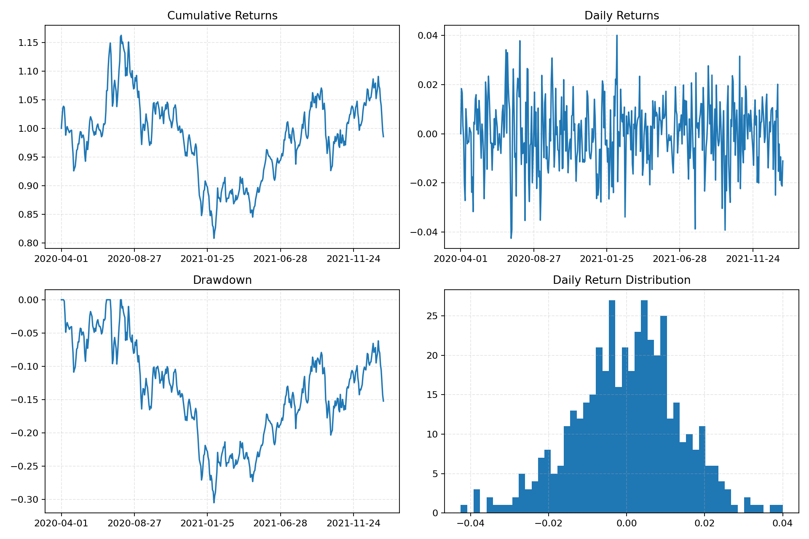
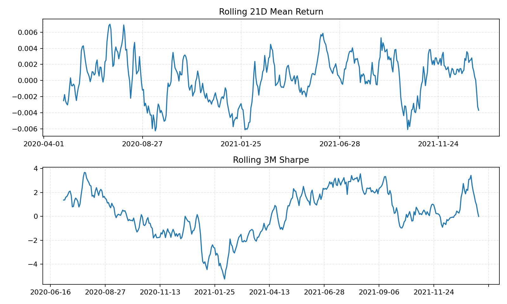
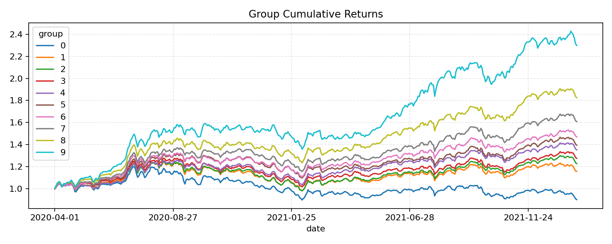
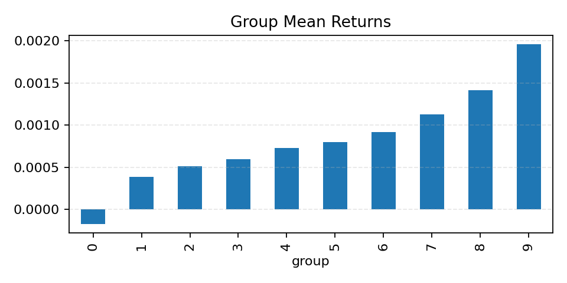
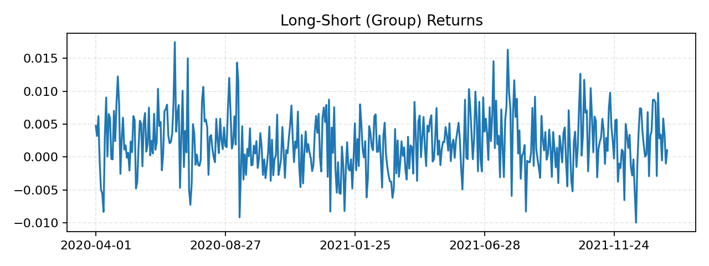
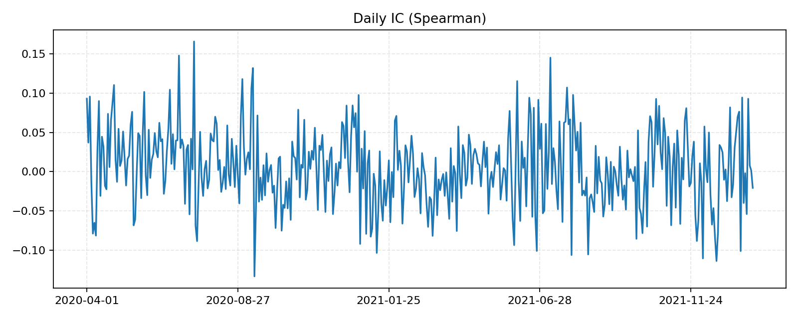
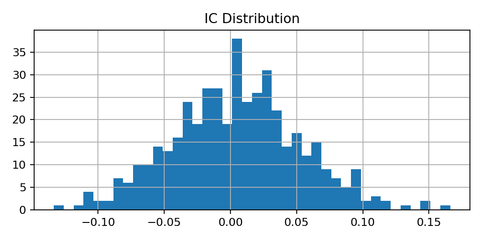

# Backtest Report: 001__volume_momentum__enable_cost-True__n_groups-10__rebalance_freq-month_start__top_n-50

## Setup

- Strategy: VolumeMomentum_mom_1430_smart
- Period: 2020-04-01 to 2022-01-21
- Engine params: `{"calculate_ic": true, "enable_cost": true, "n_groups": 10, "rebalance_freq": "month_start", "top_n": 50}`
- Strategy params: `{}`

## Performance

| Metric | Value |
|---|---:|
| Total return | -1.45% |
| Annual return | 1.47% |
| Annual volatility | 21.46% |
| Sharpe | -0.0714 |
| Max drawdown | 30.52% |
| Calmar | 0.0481 |
| Win rate | 51.58% |
| Best day | 4.00% |
| Worst day | -4.25% |

## Factor Quality

| Metric | Value |
|---|---:|
| IC mean | 0.0048 |
| IC std | 0.0485 |
| IR | 0.0982 |
| IC win rate | 54.75% |

## Trading

| Metric | Value |
|---|---:|
| Total cost | 71552.87 |
| Trade count | 2036 |
| Avg turnover | 94.82% |

## Group Long-Short

- Mean daily long-short return: 0.21%
- Daily long-short volatility: 0.44%
- Observations: 442

## Notebook Visualizer Results

### Key Metrics

| Metric | Value |
|---|---:|
| total_return | -0.0145391 |
| annual_return | 0.0146688 |
| annual_volatility | 0.214582 |
| max_drawdown | 0.305216 |
| sharpe_ratio | -0.0714465 |
| calmar_ratio | 0.0480605 |
| win_rate | 0.515837 |
| ic_mean | 0.0047604 |
| ic_std | 0.0484626 |
| ir | 0.0982283 |
| ic_win_rate | 0.547511 |

### Group Mean Returns

| Group | Mean Return |
|---:|---:|
| 0 | -0.00017246 |
| 1 | 0.000382365 |
| 2 | 0.000510115 |
| 3 | 0.000593305 |
| 4 | 0.00072605 |
| 5 | 0.000796735 |
| 6 | 0.000915688 |
| 7 | 0.00112468 |
| 8 | 0.00141622 |
| 9 | 0.00195884 |

### Rolling Metrics Tail

| index | rolling_21d_mean_return | rolling_63d_volatility | rolling_3m_sharpe |
|---|---|---|---|
| 2022-01-17 | 0.0004423 | 0.0116273 | 1.71662 |
| 2022-01-18 | 5.07267e-05 | 0.0116115 | 1.24119 |
| 2022-01-19 | -0.00147318 | 0.0118616 | 0.964673 |
| 2022-01-20 | -0.00325126 | 0.0121722 | 0.418425 |
| 2022-01-21 | -0.00370114 | 0.0121961 | -0.0105435 |

### Plots

### Saved Result Files

- `key_metrics.csv`
- `drawdown_series.csv`
- `rolling_metrics.csv`
- `group_returns_pivot.csv`
- `group_cumulative_returns.csv`
- `group_mean_returns.csv`
